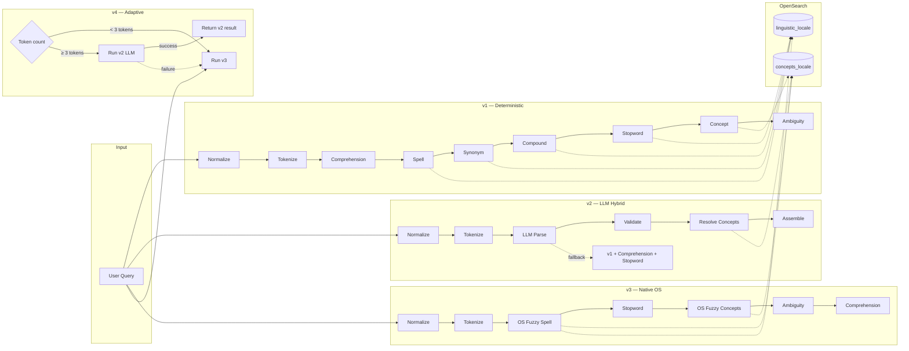

# QUS — Query Understanding Service

A Go library and HTTP service that parses search queries into structured intent: normalized tokens, concept matches, filters, sorts, and rewrites. It provides four pipelines: deterministic (v1), LLM-augmented hybrid (v2), native OpenSearch-driven (v3), and adaptive (v4) which routes short queries to v3 and longer queries straight to v2 LLM.

## Architecture



**v1** handles synonyms, compounds, and spell correction via OpenSearch-backed linguistic lookups (`LinguisticLookup`, `CompoundLookup`, `SpellChecker`). All dictionary data lives in OpenSearch — no YAML data files.

**v2** uses an LLM (AWS Bedrock) as an **advisory** layer. All LLM outputs are schema-validated against allowlists. On LLM failure, falls back to the full v1 deterministic pipeline including comprehension. Handles Nova model quirks (field name normalization: `rewrite` vs `rewrites`, filter field aliases).

**v3** delegates spell correction, synonym matching, and compound handling to OpenSearch natively via `fuzziness: AUTO` + `cross_fields` multi_match.

**v4** (adaptive) routes queries based on non-stopword token count. Short queries (< `direct_llm_token_threshold`, default 3) go to v3. Longer queries skip v3 entirely and go straight to v2 LLM for semantic understanding. If v2 fails or returns empty, falls back to v3. Configurable via `qus.yaml` — set threshold to 0 to disable routing (v3 only).

All pipelines benefit from **locale-aware stemming** on the concept index — queries like "veggies" match "veggie", "burgers" matches "burger", etc. Each locale gets its own language-specific analyzer (English, German, French, Dutch, Italian, Spanish, Swedish, Danish, Norwegian, CJK).

## Project Structure

```
pkg/
  model/                      # Public domain types (importable by consumers)
  analyzer/                   # Public API for in-process analysis
  config/                     # Configuration types and loaders
cmd/                          # Cobra CLI (HTTP server mode)
configs/                      # YAML configs (qus.yaml, comprehension, LLM allowlists/prompt)
internal/
  application/routes/         # Chi HTTP handlers
  domain/
    pipeline/                 # v1 deterministic pipeline steps
    hybrid/                   # v2 hybrid LLM pipeline
    native/                   # v3 native OS-driven pipeline
    adaptive/                 # v4 adaptive pipeline (token-count routing: v3 or v2)
  infra/
    bedrock/                  # AWS Bedrock Converse API client (with Nova field normalization)
    opensearch/               # OS client: LinguisticLookup, CompoundLookup, FuzzySearcher
    observability/            # Prometheus metrics
scripts/
  seed-opensearch.sh          # Seed concept + linguistic indices (26 locales)
  seed-compounds.sh           # Seed CMP entries from TSV files
  compound-data/              # TSV compound word rules per locale
  locale-data/                # Concept/linguistic ndjson per locale
testdata/golden/              # Golden test fixtures (ndjson)
```

---

## Quick Start

### Prerequisites

- Go 1.26+
- OpenSearch running locally (or remote)

```bash
# Start OpenSearch
docker-compose up -d

# Seed indices with concept + linguistic data (26 locales)
./scripts/seed-opensearch.sh

# Seed compound word rules (8 locales, 1,767 entries)
./scripts/seed-compounds.sh
```

### Installation

```bash
go get github.com/ahmedalaahagag/query-understanding-service
```

## How to Use

### As a Go Library (recommended)

Import `pkg/analyzer` to run query analysis in-process — no HTTP calls needed.

```go
import (
    "github.com/ahmedalaahagag/query-understanding-service/pkg/analyzer"
    "github.com/ahmedalaahagag/query-understanding-service/pkg/config"
    "github.com/ahmedalaahagag/query-understanding-service/pkg/model"
)

// 1. Create the analyzer (once at startup)
a, err := analyzer.New(ctx, analyzer.Config{
    ConfigDir: "configs",
    OpenSearch: config.OpenSearchConfig{
        URL: "http://localhost:9200",
    },
})

// 2. Analyze queries
resp, err := a.Analyze(ctx, model.AnalyzeRequest{
    Query:  "cheap chicken recipes",
    Locale: "en-GB",
    Market: "uk",
})
// resp.NormalizedQuery → "chicken recipes"
// resp.Concepts       → [{id: "uk-cat-chicken", label: "chicken", ...}]
// resp.Sort           → {field: "price", direction: "asc"}
```

#### Choosing a Pipeline

```go
// v1: Deterministic — spell, synonym, compound, concept, comprehension
resp, _ := a.Analyze(ctx, req)

// v3: Native OS — fuzzy spell + concept matching via OpenSearch
resp, _ := a.AnalyzeV3(ctx, req)

// v2: LLM hybrid — requires LLM config, falls back to v1 on failure
resp, _ := a.AnalyzeV2(ctx, req)

// v4: Adaptive — v3 fast path, escalates to v2 for complex queries
resp, _ := a.AnalyzeV4(ctx, req)
```

**When to use which:**

| Pipeline | Best for | Latency | Requires |
|---|---|---|---|
| v1 | Production — predictable, testable | ~5–15ms | OpenSearch |
| v3 | Typo-heavy queries, minimal config | ~10–20ms | OpenSearch |
| v2 | Complex intent (calories, dietary) | ~200–500ms | OpenSearch + LLM |
| v4 | Best of both — fast for simple, smart for complex | ~10–500ms | OpenSearch + LLM (optional) |

#### Enabling v2 (LLM hybrid)

```go
a, err := analyzer.New(ctx, analyzer.Config{
    ConfigDir: "configs",
    OpenSearch: config.OpenSearchConfig{URL: "http://localhost:9200"},
    LLM: config.LLMConfig{
        Enabled:  true,
        Region:   "eu-west-1",
        Model:    "eu.amazon.nova-lite-v1:0",
        FailOpen: true,                     // fall back to v1 on LLM failure
    },
})
if a.HasV2() {
    resp, err := a.AnalyzeV2(ctx, req)
}
```

#### Import Types Only

If you call QUS over HTTP but want shared request/response types:

```go
import "github.com/ahmedalaahagag/query-understanding-service/pkg/model"

var req model.AnalyzeRequest
var resp model.AnalyzeResponse
```

### As a Standalone HTTP Service

```bash
cp .env.example env    # Edit with your settings
docker-compose up -d   # Start OpenSearch
make run               # Start QUS HTTP server on :8080
```

---

## Configuration Files

QUS loads configuration from a directory (default: `configs/`). Each file serves a specific purpose.

### Required Files

#### `qus.yaml` — Pipeline Settings

Controls the deterministic pipeline behavior.

```yaml
pipeline:
  enabled_steps:
    - normalize
    - tokenize
    - spell
    - synonym
    - compound
    - concept
    - ambiguity
    - comprehension

spell:
  enabled: true
  min_token_length: 4          # Skip spell-check for short tokens
  confidence_threshold: 0.85   # Minimum score to accept a correction

concept:
  shingle_max_size: 4          # Max tokens in a concept span (e.g. "peanut butter" = 2)
  max_matches_per_span: 3      # Max concept candidates per token span

ambiguity:
  prefer_longest_span: true    # Prefer "ice cream" over "ice" + "cream"
  min_score_delta: 0.05        # Score gap needed to pick one concept over another
```

#### `comprehension.yaml` — Filter & Sort Extraction Rules

Locale-keyed regex rules for extracting filters and sort directives from natural language. Supports 8 languages (en, de, fr, nl, it, es, sv, da) with rules for price, prep time, calories, difficulty, and servings.

```yaml
en:
  filter_rules:
    # Numeric: capture group 2 is the number
    - pattern: '(under|less than)\s+(\d+)\s*(minutes?|mins?)'
      field: prep_time
      operator: lt
    # Keyword: static value, no capture group needed
    - pattern: '\b(easy|simple|beginner)\b'
      field: difficulty_level
      operator: eq
      value: easy
    # Generic price (after specific rules — overlap detection prevents conflicts)
    - pattern: '(under|less than|cheaper than)\s+(\d+(?:\.\d+)?)'
      field: price
      operator: lt
  sort_rules:
    - pattern: '\b(cheapest|lowest price)\b'
      field: price
      direction: asc
    - pattern: '\b(fastest|quickest)\b'
      field: prep_time
      direction: asc

de:
  filter_rules:
    - pattern: '(unter|weniger als)\s+(\d+)\s*(Minuten|Min)'
      field: prep_time
      operator: lt
    - pattern: '\b(einfach|simpel)\b'
      field: difficulty_level
      operator: eq
      value: easy
    # ... (same structure for all locales)
```

More specific rules (prep_time, calories) must come before the generic price rule. The engine tracks consumed character regions so overlapping matches don't produce duplicate filters.

### Config Files per Pipeline

| Config File | v1 | v2 | v3 | v4 |
|---|---|---|---|---|
| `qus.yaml` | ✅ | — | ✅ | ✅ |
| `comprehension.yaml` | ✅ | — | ✅ | ✅ |
| `allowed_filters.yaml` | — | ✅ | — | ✅* |
| `allowed_sorts.yaml` | — | ✅ | — | ✅* |
| `llm_prompt.txt` | — | ✅ | — | ✅* |

*v4 uses these when escalating to v2.

Synonyms and compounds are stored in OpenSearch's linguistic index (types `SYN`, `HYP`, `CMP`) — no YAML data files needed.

### V2 Hybrid Pipeline Files (optional)

These are only needed when `LLM.Enabled = true`.

#### `allowed_filters.yaml` — Filter Allowlist

Defines which filters the LLM is allowed to produce. Any LLM-suggested filter not in this list is silently dropped.

```yaml
filters:
  - field: price
    operators: [lt, lte, gt, gte, eq]
    type: number
  - field: prep_time
    operators: [lt, lte, gt, gte, eq]
    type: number
  - field: calories
    operators: [lt, lte, gt, gte, eq]
    type: number
  - field: dietary
    operators: [eq, in]
    type: keyword
  - field: cuisine
    operators: [eq, in]
    type: keyword
  - field: ingredient
    operators: [eq, in]
    type: keyword
  - field: category
    operators: [eq, in]
    type: keyword
  - field: meal_type
    operators: [eq, in]
    type: keyword
  - field: cooking_method
    operators: [eq, in]
    type: keyword
  - field: availability
    operators: [eq, in]
    type: keyword
  - field: difficulty_level
    operators: [eq, in]
    type: keyword
```

#### `allowed_sorts.yaml` — Sort Allowlist

Defines which sort keys the LLM is allowed to produce.

```yaml
sorts:
  - key: relevance
  - key: price_asc
  - key: price_desc
  - key: newest
  - key: prep_time_asc
  - key: calories_asc
```

#### `llm_prompt.txt` — LLM System Prompt

The system prompt sent to the LLM. The allowed filters and sorts are automatically appended at runtime. Keep it compact for low latency.

```
Parse food search query into JSON. Raw JSON only, no markdown.
{"normalizedQuery":"","rewrites":[],"candidateConcepts":[{"label":"","field":"","confidence":0.0}],"filters":[{"field":"","operator":"","value":null,"confidence":0.0}],"sort":{"field":"","direction":"asc|desc","confidence":0.0},"confidence":0.0,"warnings":[]}
Rules: only use ALLOWED FILTERS/SORTS below. Fix typos. Empty arrays if uncertain. Max 1 rewrite.
```

---

## OpenSearch Indexes

QUS expects two OpenSearch indexes per locale. Use the seed script to populate them.

### Concept Index (`concepts_{locale}`)

Stores known entities (categories, ingredients, tags) that QUS can recognize in queries. Each locale's index uses a **language-specific analyzer** with stemming so that inflected forms match (e.g. "veggies" → "veggie", "Hähnchen" → "hähnchen").

| Locale prefix | Analyzer |
|---|---|
| `en_*` | English |
| `de_*` | German |
| `fr_*` | French |
| `nl_*` | Dutch |
| `it_*` | Italian |
| `es_*` | Spanish |
| `sv_*` | Swedish |
| `da_*` | Danish |
| `nb_*` | Norwegian |
| `ja_*` | CJK |
| other | Standard (no stemming) |

```json
{
  "id": "uk-cat-chicken",
  "label": "chicken",
  "field": "category",
  "aliases": ["poultry"],
  "weight": 10,
  "locale": "en_GB",
  "market": "UK"
}
```

### Linguistic Index (`linguistic_{locale}`)

Stores all linguistic enrichment data that QUS uses to understand queries beyond simple tokenization. Each document has a `type` field that determines how it's used in the pipeline.

#### Document Types

| Type | Name | Purpose | Used by |
|---|---|---|---|
| `SYN` | Synonym | Maps alternate terms to canonical forms | v1 (SynonymExpander) |
| `HYP` | Hypernym | Maps specific terms to broader categories | v1 (SynonymExpander) |
| `CMP` | Compound | Joins/splits compound words | v1 (CompoundHandler) |
| `SW` | Stopword | Common words to filter before concept matching | v1, v2, v3 (StopwordFilter) |

#### Document Schema

All types share the same document shape:

```json
{
  "term": "string",
  "variant": "string",
  "type": "SYN | HYP | CMP | SW",
  "locale": "en_GB"
}
```

#### SYN — Synonyms

Maps alternate or regional terms to canonical forms. When QUS encounters the `term`, it expands the query to also search for the `variant`.

```json
{"term": "capsicum", "variant": "bell pepper", "type": "SYN", "locale": "en_AU"}
{"term": "aubergine", "variant": "eggplant", "type": "SYN", "locale": "en_GB"}
{"term": "courgette", "variant": "zucchini", "type": "SYN", "locale": "en_GB"}
```

#### HYP — Hypernyms

Maps specific terms to broader parent categories. Used for query expansion — searching "chicken breast" could also match the broader "poultry" category.

```json
{"term": "chicken breast", "variant": "poultry", "type": "HYP", "locale": "en_GB"}
{"term": "salmon fillet", "variant": "fish", "type": "HYP", "locale": "en_GB"}
```

#### CMP — Compounds

Handles compound words that users may type as one word or two. The `term` is the joined form, the `variant` is the split form. The pipeline checks both directions.

```json
{"term": "icecream", "variant": "ice cream", "type": "CMP", "locale": "en_GB"}
{"term": "peanutbutter", "variant": "peanut butter", "type": "CMP", "locale": "en_GB"}
{"term": "eiskaffee", "variant": "eis kaffee", "type": "CMP", "locale": "de_DE"}
```

Compound data is managed as TSV files in `scripts/compound-data/` and seeded via `seed-compounds.sh`. Currently 1,767 entries across 8 locales.

#### SW — Stopwords

Common function words (articles, prepositions, conjunctions) that are stripped from queries before concept matching. This prevents false positive matches — e.g. "for" matching a concept alias like "for kids" → "family friendly".

```json
{"term": "the", "type": "SW", "locale": "en_GB"}
{"term": "for", "type": "SW", "locale": "en_GB"}
{"term": "der", "type": "SW", "locale": "de_DE"}
{"term": "die", "type": "SW", "locale": "de_DE"}
```

Stopwords are loaded once at startup for all 26 supported locales via `FetchAllStopwords()`. Each locale gets its own stopword set, selected at runtime based on the request's locale.

### Seeding

Run `seed-opensearch.sh` first (creates indices with locale-aware analyzers), then `seed-compounds.sh` (adds CMP entries to existing linguistic indices).

```bash
# 1. Seed all concept + linguistic indices (26 locales, destructive — recreates indices)
./scripts/seed-opensearch.sh

# 2. Seed compound rules from TSV files (1,767 entries across 8 locales)
./scripts/seed-compounds.sh

# Seed compounds for a single locale
./scripts/seed-compounds.sh http://localhost:9200 en_gb

# Custom OpenSearch URL
./scripts/seed-opensearch.sh http://my-opensearch:9200
```

Sample data is provided in `scripts/locale-data/` for 20+ locales and `scripts/compound-data/` for 8 locales:

| Locale | Entries | Language |
|---|---|---|
| `en_gb` | 472 | English (UK) |
| `en_us` | 301 | English (US) |
| `de_de` | 234 | German |
| `nl_nl` | 177 | Dutch |
| `sv_se` | 156 | Swedish |
| `fr_fr` | 156 | French |
| `es_es` | 136 | Spanish |
| `it_it` | 135 | Italian |

#### Adding Compound Words

Add entries to `scripts/compound-data/{locale}.tsv` (tab-separated, lines starting with `#` are ignored):

```
# DAIRY
icecream	ice cream
peanutbutter	peanut butter
```

Then run `./scripts/seed-compounds.sh` to index them.

---

## Environment Variables

For standalone HTTP mode, configure via environment (see `.env.example`):

| Variable | Default | Description |
|---|---|---|
| `QUS_HTTP_PORT` | `8080` | HTTP server port |
| `QUS_OPENSEARCH_URL` | `http://localhost:9200` | OpenSearch endpoint |
| `QUS_OPENSEARCH_USERNAME` | | OpenSearch basic auth username |
| `QUS_OPENSEARCH_PASSWORD` | | OpenSearch basic auth password |
| `QUS_OPENSEARCH_CONCEPT_INDEX_PREFIX` | `concepts` | Concept index prefix |
| `QUS_OPENSEARCH_LINGUISTIC_INDEX_PREFIX` | `linguistic` | Linguistic index prefix |
| `QUS_CONFIG_DIR` | `configs` | Path to config files directory |
| `QUS_LLM_ENABLED` | `false` | Enable v2 hybrid pipeline |
| `QUS_LLM_REGION` | `eu-west-1` | AWS Bedrock region |
| `QUS_LLM_MODEL` | `eu.amazon.nova-lite-v1:0` | Bedrock model ID |
| `QUS_LLM_MAX_RETRIES` | `1` | Retry count on LLM failure |
| `QUS_LLM_MIN_CONFIDENCE` | `0.65` | Minimum confidence threshold |
| `QUS_LLM_FAIL_OPEN` | `true` | Fall back to deterministic on LLM failure |

---

## REST API

### POST /v1/analyze

Deterministic query analysis.

**Query parameters:** `locale`, `country`

```bash
curl -X POST 'http://localhost:8080/v1/analyze?locale=en-GB&country=uk' \
  -H 'Content-Type: application/json' \
  -d '{"query": "cheap chicken recipes"}'
```

**Response:**

```json
{
  "originalQuery": "cheap chicken recipes",
  "normalizedQuery": "chicken recipes",
  "tokens": [
    {"value": "chicken", "normalized": "chicken", "position": 0},
    {"value": "recipes", "normalized": "recipes", "position": 1}
  ],
  "rewrites": ["chicken recipes"],
  "concepts": [
    {"id": "uk-cat-chicken", "label": "chicken", "matchedText": "chicken", "field": "category", "score": 1.0, "source": "exact", "start": 1, "end": 1}
  ],
  "filters": [],
  "sort": {"field": "price", "direction": "asc"},
  "warnings": []
}
```

Note: The comprehension engine extracts "cheap" as a sort directive (`price asc`) and strips consumed tokens from the normalized query and token list. Concept positions (`start`/`end`) reflect pre-comprehension positions.

### POST /v2/analyze

Hybrid LLM-augmented analysis (requires `QUS_LLM_ENABLED=true`).

**Query parameters:** `locale`, `country`

```bash
curl -X POST 'http://localhost:8080/v2/analyze?locale=en-GB&country=uk' \
  -H 'Content-Type: application/json' \
  -d '{"query": "chicken under 500 calories"}'
```

### POST /v3/analyze

Native OpenSearch-driven analysis. Delegates spell correction and concept matching to OpenSearch via `fuzziness: AUTO` + `cross_fields` multi_match, with locale-aware stemming.

**Query parameters:** `locale`, `country`

```bash
curl -X POST 'http://localhost:8080/v3/analyze?locale=en-GB&country=uk' \
  -H 'Content-Type: application/json' \
  -d '{"query": "chiken soup under 5"}'
```

### POST /v4/analyze

Adaptive pipeline. Routes based on non-stopword token count: short queries (< 3 tokens) use v3 native OS (~10–20ms), longer queries go straight to v2 LLM (~200–500ms). Falls back to v3 if LLM is unavailable or returns empty. Threshold configurable via `direct_llm_token_threshold` in `qus.yaml`.

**Query parameters:** `locale`, `country`

```bash
curl -X POST 'http://localhost:8080/v4/analyze?locale=en-GB&country=uk' \
  -H 'Content-Type: application/json' \
  -d '{"query": "show me something easy for dinner"}'
```

The response includes the standard `AnalyzeResponse` fields plus routing metadata:

| Extra field | Type | Description |
|---|---|---|
| `used_v2` | `bool` | Whether the query was routed to v2 LLM |
| `v2_fallback` | `bool` | Whether v2 failed and fell back to v3 |

### POST /v2/analyze/debug

Same as v2, returns additional debug info (raw LLM output, validation details, timing).

### GET /healthz

Returns `{"status": "ok"}` with HTTP 200.

### GET /metrics

Prometheus metrics endpoint.

---

## Response Types Reference

### `model.AnalyzeResponse`

| Field | Type | Description |
|---|---|---|
| `originalQuery` | `string` | The raw input query |
| `normalizedQuery` | `string` | Lowercased, trimmed, whitespace-collapsed query |
| `tokens` | `[]Token` | Tokenized query terms |
| `rewrites` | `[]string` | Alternative query forms (spell corrections, synonyms) |
| `concepts` | `[]ConceptMatch` | Recognized entities matched against OpenSearch |
| `filters` | `[]Filter` | Extracted filter directives (e.g. price < 10) |
| `sort` | `*SortSpec` | Extracted sort directive (e.g. cheapest → price asc) |
| `warnings` | `[]string` | Non-fatal issues (unresolved concepts, validation drops) |

### `model.Token`

| Field | Type | Description |
|---|---|---|
| `value` | `string` | Original token text |
| `normalized` | `string` | Lowercased/cleaned token |
| `position` | `int` | Zero-based position in query |

### `model.ConceptMatch`

| Field | Type | Description |
|---|---|---|
| `id` | `string` | OpenSearch document ID |
| `label` | `string` | Canonical concept label |
| `matchedText` | `string` | Text in the query that matched |
| `field` | `string` | Index field (e.g. `category`, `ingredient`) |
| `score` | `float64` | Match confidence score |
| `source` | `string` | How it was matched: `exact`, `alias`, `fuzzy`, or `llm` |
| `start` | `int` | Start token position |
| `end` | `int` | End token position |

### `model.Filter`

| Field | Type | Description |
|---|---|---|
| `field` | `string` | Filter field name (e.g. `price`, `calories`) |
| `operator` | `string` | Comparison operator: `eq`, `lt`, `lte`, `gt`, `gte`, `in` |
| `value` | `any` | Filter value (number, string, or list) |

### `model.SortSpec`

| Field | Type | Description |
|---|---|---|
| `field` | `string` | Sort field name |
| `direction` | `string` | `asc` or `desc` |

---

## Development

```bash
make test    # Run all tests with race detector
make lint    # Run golangci-lint
make build   # Build binary to bin/
make fmt     # Format code
```

## Docker

```bash
docker build -t qus .
docker run -p 8080:8080 --env-file env qus
```

Docker Compose brings up OpenSearch for local development:

```bash
docker-compose up -d
```
